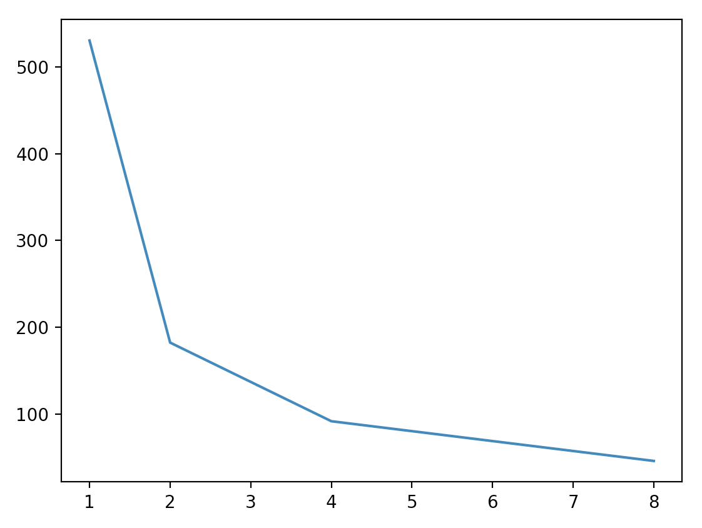
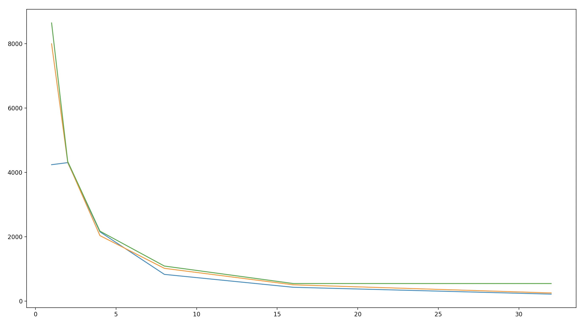

# Report

以下为 `test_gmem.cu` 中 `STRIDE` 分别取 $1,2,4,8$ 时的运行结果：

```
stride:    1
bandwidth: 530.123

stride:    2
bandwidth: 182.482

stride:    4
bandwidth: 91.9953

stride:    8
bandwidth: 46.2862
```

总结为表格：

|stride|1|2|4|8|
|---|---|---|---|---|
|bandwidth|530.123|182.482|91.9953|46.2862|

对应的图标为：


改变 `STRIDE` 值会改变GPU内存的访问。
由于内存合并，Warp访问的都是一段连续的内存，因此当 `STRIDE` 大时，内存访问更不连续，从而降低了性能。
除此之外，还有GPU中的各级Cache参与执行过程，用于加速程序的效率。

以下为 `test_smem.cu` 中 `BITWIDTH` 分别取 $2,4,8$ ， `STRIDE` 取 $1,2,4,8,16,32$ 时的运行结果：

```
bitwidth:  2
stride:    1
bandwidth: 4238.66

bitwidth:  4
stride:    1
bandwidth: 7998.21

bitwidth:  8
stride:    1
bandwidth: 8646.66

bitwidth:  2
stride:    2
bandwidth: 4302.97

bitwidth:  4
stride:    2
bandwidth: 4321.4

bitwidth:  8
stride:    2
bandwidth: 4339.23

bitwidth:  2
stride:    4
bandwidth: 2152.1

bitwidth:  4
stride:    4
bandwidth: 2034.46

bitwidth:  8
stride:    4
bandwidth: 2173.54

bitwidth:  2
stride:    8
bandwidth: 828.292

bitwidth:  4
stride:    8
bandwidth: 1017.2

bitwidth:  8
stride:    8
bandwidth: 1087.67

bitwidth:  2
stride:    16
bandwidth: 427.428

bitwidth:  4
stride:    16
bandwidth: 505.057

bitwidth:  8
stride:    16
bandwidth: 544.068

bitwidth:  2
stride:    32
bandwidth: 215.19

bitwidth:  4
stride:    32
bandwidth: 251.606

bitwidth:  8
stride:    32
bandwidth: 544.069
```

可制作成表格如下：

|STRIDE\BITWIDTH|2|4|8|
|---|---|---|---|
|1|4238.66|7998.21|8646.66|
|2|4302.97|4321.4|4339.23|
|4|2152.1|2034.46|2173.54|
|8|828.292|1017.2|1087.67|
|16|427.428|505.057|544.068|
|32|215.19|251.606|544.069|

对应的图表如下：


当 `BITWIDTH` 固定时，程序的性能变化来源于Bank机制。
当 `STRIDE` 固定， `BITWIDTH` 变化时，可以发现大体上 `BITWIDTH` 从 `2` 变为 `4` 时效率的提升幅度要高于 `4` 到 `8` 的提升。由于每一个bank的宽度为4Byte=32bit，因此从 `2` 变为 `4` 时可以更好利用硬件来得到性能的提升。而当 `BITWIDTH` 变为 `8` 时，一个数据需要存放在两个bank里，因此效率提升幅度会有所降低。